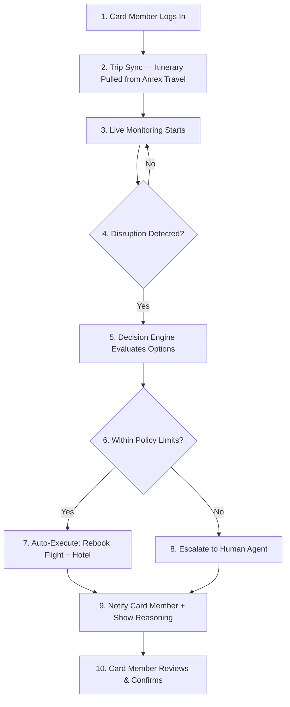
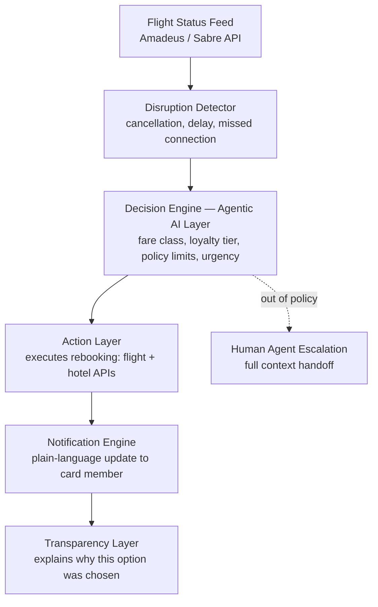

# 🧳✈️ TripGuard AI

**Autonomous Travel-Disruption Concierge**

*American Express CodeStreet Hackathon 2026*

Flights get cancelled. Connections get missed. TripGuard AI detects the disruption the moment it happens — and fixes it before the card member even knows there's a problem.

---

## 📑 Quick Navigation

1. [The Problem](#-the-problem)
2. [Our Solution](#-our-solution)
3. [What Makes This Different](#-what-makes-this-different)
4. [System Design — Login to Execution](#-system-design--login-to-execution)
5. [Architecture](#️-architecture)
6. [Tech Stack](#️-tech-stack)
7. [Business Impact](#-business-impact-for-american-express)
8. [Transparency & Trust](#-transparency--trust)
9. [Research Foundation](#-research-foundation)
10. [Feasibility & Roadmap](#-feasibility--roadmap)
11. [Team](#-team)
12. [Demo](#️-demo)

---

## 🚩 The Problem

Travel disruptions are one of the most stressful moments in a card member's journey — and today, resolving them is almost entirely manual.

- A flight gets cancelled or a connection is missed
- The card member finds out from an airline app or announcement — not proactively
- They call support, wait on hold, and manually search for alternate flights and hotels
- By the time they're rebooked, hours have been lost and the experience has already damaged trust in the card

Existing travel apps only **display** disruption information. None of them **act** on it. For a premium card brand built on travel benefits and concierge service, this is a gap — not a nice-to-have.

---

## 💡 Our Solution

**TripGuard AI** is an autonomous agent that watches a card member's itinerary in real time and, when a disruption occurs, independently:

1. **Detects** the disruption (cancellation, delay, missed connection) the moment it's reported
2. **Decides** the best resolution path based on real-time alternatives, fare rules, loyalty status, and card benefit policy
3. **Acts** — rebooks the flight, adjusts the hotel stay, and confirms the new plan
4. **Notifies** the card member with a clear, plain-language explanation of what changed and why
5. **Escalates** to a human agent only when a decision falls outside policy limits

No manual searching. No hold music. No confusion — just a resolved trip and a clear explanation.

---

## 🌟 What Makes This Different

| Existing Travel Apps | TripGuard AI |
|---|---|
| Notify you *after* things go wrong | Detects disruption in real time |
| You manually rebook | Autonomously rebooks within policy |
| Static itinerary display | Live, self-healing itinerary |
| No reasoning shown | Transparent, explainable decisions |
| Reactive | Proactive |

---

## 🔄 System Design — Login to Execution

This section walks through **exactly how the system behaves**, from the moment a card member logs in to the moment their disruption is resolved. Written so anyone — technical or not — can follow it end to end.

### Step-by-step, in plain English

| Step | What Happens | Why It Matters |
|---|---|---|
| **1. Login** | Card member logs in via existing Amex credentials (OAuth/session token) | No new account needed — zero added friction |
| **2. Trip Sync** | System pulls existing bookings from Amex Travel / linked email | Fully automatic — no manual itinerary entry |
| **3. Live Monitoring** | Runs continuously in the background using flight status APIs | Member does nothing; system watches quietly |
| **4. Disruption Detected?** | Flags cancellations, delays, or risky connections instantly | Catches problems the moment they occur, not after |
| **5. Decision Engine** | Evaluates alternatives using fare class, loyalty tier, policy, and urgency | This is the "brain" — turns raw data into the right choice |
| **6. Policy Check** | Confirms whether the system is allowed to act on its own | Keeps every autonomous action within safe, approved limits |
| **7. Auto-Execute** | Rebooks flight + adjusts hotel automatically | Resolves the disruption in minutes, not hours |
| **8. Escalation** | Hands off to a human agent with full case history if needed | No cold handoffs — human never starts from zero |
| **9. Notify** | Sends a plain-language update explaining what happened and why | Builds trust — member always knows what changed and why |
| **10. Review & Confirm** | Member can review the update; system returns to monitoring | Keeps the member in control while automation does the work |

---

## 🏗️ Architecture

**The 5 core components:**

| # | Component | What It Does |
|---|---|---|
| 1 | **Flight Status Feed** | Pulls live disruption events from Amadeus/Sabre |
| 2 | **Decision Engine** | The agentic AI core — weighs alternatives and picks the best fix |
| 3 | **Action Layer** | Executes the rebooking automatically |
| 4 | **Notification Engine** | Informs the card member in plain language |
| 5 | **Transparency Layer** | Shows the reasoning behind every decision |

If a decision falls outside pre-approved policy (e.g. cost above threshold, no acceptable alternative), the system **escalates to a human agent with full context** — no cold handoffs.

---

## 🛠️ Tech Stack

| Layer | Technology |
|---|---|
| Frontend | React Native (mobile-first, card member notifications & live status) |
| Backend & APIs | Node.js, FastAPI |
| Agentic AI Framework | LangChain / AutoGen (decision-making & orchestration) |
| Travel Data | Amadeus for Developers API (flight status, availability) |
| Rules Engine | Custom policy engine (fare rules, benefit limits, loyalty tiers) |
| Database | PostgreSQL (itinerary & policy data), Redis (real-time event cache) |
| Notifications | Push/SMS/Email via Twilio or Firebase Cloud Messaging |
| Cloud | AWS (Lambda for event triggers, S3 for logs) |

---

## 📊 Business Impact for American Express

- **Reduced support load** — fewer disruption-related calls into customer service, freeing agents for complex cases
- **Stronger retention** — a seamless, proactive experience reinforces the value of premium travel benefits and annual fees
- **Brand differentiation** — positions Amex ahead of competitors who offer only static travel insurance or itinerary tracking
- **Higher NPS in a high-stress moment** — disruptions are emotionally charged; resolving them flawlessly builds outsized loyalty
- **Scalable to millions of cardholders** — cloud-native, API-first design supports enterprise scale from day one

---

## 🔎 Transparency & Trust

Every autonomous decision comes with a plain-language explanation:

> *"Your original flight was cancelled. We rebooked you on the next available flight in your fare class, arriving only 40 minutes later than planned, and extended your hotel check-in by 2 hours at no extra cost — all within your card's travel protection policy."*

This reasoning layer builds member trust in autonomous decisions and gives Amex a full audit trail for every action taken. Anything above policy limits **always goes to a human** — the system never overrides real judgment on high-stakes calls.

---

## 📚 Research Foundation

TripGuard AI's architecture is not just an implementation exercise — each core design decision is grounded in current academic and industry research on agentic AI, airline disruption recovery, and human-in-the-loop trust frameworks.

| # | Title | Grounds This Part of TripGuard AI | Link |
|---|---|---|---|
| 1 | AgentAbstain: Do LLM Agents Know When Not to Act? | Policy Check & Escalation (Steps 6–8) | [arXiv](https://arxiv.org/html/2607.10059) |
| 2 | Disruption Management in Airline Operations: A Solver-based Approach using Time-Space Network Optimization | Decision Engine | [arXiv](https://arxiv.org/html/2510.26831) |
| 3 | Agentic AI and Autonomous Decision-Making: A Review of Human-in-the-Loop Frameworks, Oversight Mechanisms, and Trust Calibration | Human Agent Escalation | [ResearchGate](https://www.researchgate.net/publication/403947038) |
| 4 | Human-in-the-Loop Agentic AI for Financial Services | Transparency & Trust Layer | [ResearchGate](https://www.researchgate.net/publication/400549815) |
| 5 | Addressing the Systemic Complexity of Airline Irregular Operations: Toward Integrated Schedule Recovery | Integrated (vs. siloed) recovery approach | [ScienceDirect](https://www.sciencedirect.com/science/article/abs/pii/S0969699725001887) |
| 6 | Airline Recovery Problem Under Disruptions: A Review | Overall problem framing | [arXiv](https://arxiv.org/abs/2401.04866) |

📄 Full reference list with additional supporting papers: [REFERENCES.md](./REFERENCES.md)

---

## 🚀 Feasibility & Roadmap

**Hackathon MVP (Round 2 scope):**
- Simulated live flight disruption event
- End-to-end automated rebooking flow (flight + hotel)
- Real-time notification with reasoning shown to the user
- Escalation path demo for out-of-policy scenarios

**Future scale path:**
- Integration with live airline/hotel partner APIs
- Expansion to rental cars, event tickets, and other travel bookings
- Personalization based on individual member travel history and preferences

---

## 👥 Team

| Name | Role |
|---|---|
| [Your Name] | [Role] |
| [Teammate] | [Role] |
| [Teammate] | [Role] |

---

## 📽️ Demo

- **Video**: [link here]
- **Live Prototype**: [link here]
- **Pitch Deck**: [link here]

---

<em>Built for the American Express CodeStreet Hackathon — turning travel disruptions from a moment of stress into a moment of trust.</em>

